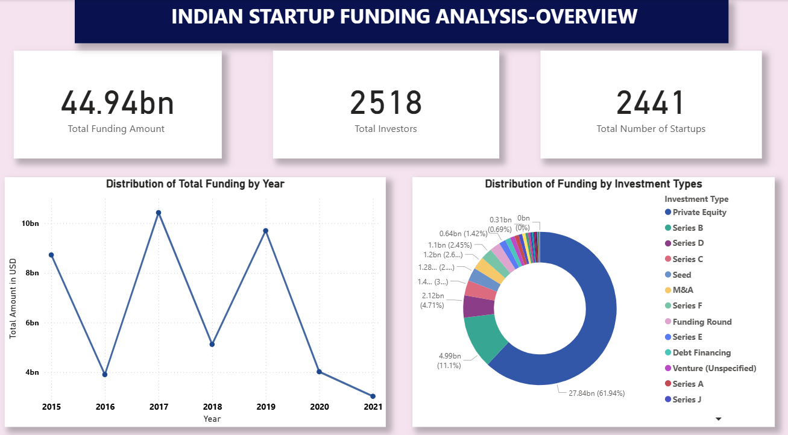
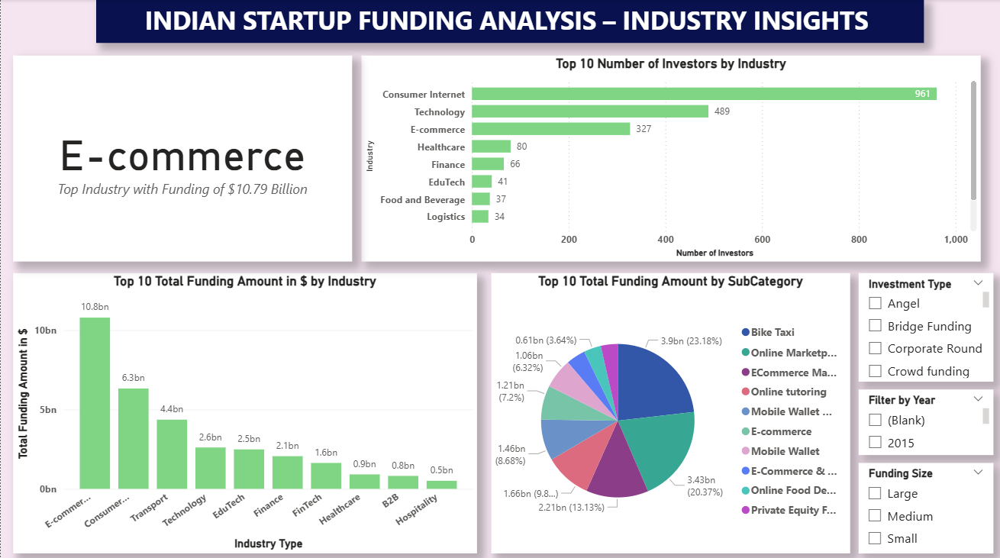
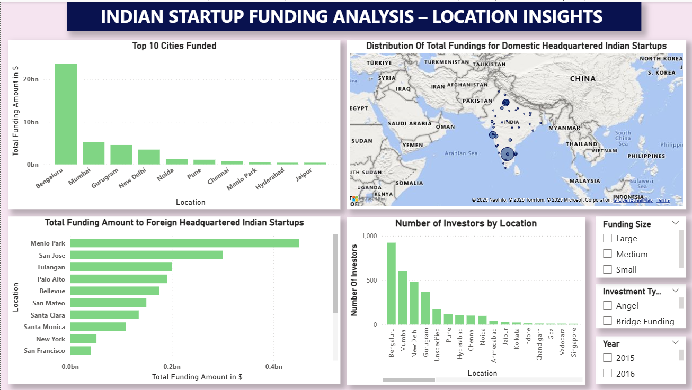

# Indian Startups Funding Analysis(2015-2021)

## Overview
Built this project that involves an Interactive Power BI dashboard analyzing Indian startup funding (2015–2021). 
The initial data was cleaned in Google Sheets &amp; Power Query. The key findings include top industries, leading cities &amp; funding patterns at different yearly stages.

## Files
- `Indian Startup Analysis.pbix` → Power BI dashboard  
- `/screenshots/` → Dashboard previews (Overview, Industry Insights, Location Insights)  
- `Data Cleaning Notes.md` → Full explanation of preprocessing and transformations applied

## Data Cleaning & Preparation
Before analysis, the dataset required cleaning so that proper findings and analysis could be achieved.This was done using Google Sheets and Power Query:

1. **Date Column**
   - Left blanks as it is since missing dates did not make any impact on the funding analysis.  
   - Ensured all valid dates were converted to proper datetime format.  

2. **Amount Column**
   - Removed commas, currency symbols, and text noise.  
   - Converted column to numeric (currency).  
   - Replaced blanks with `0` for calculation consistency.  
   - Created `Amount_Status` column to track `Known` vs `Unspecified` funding.
   - Replaced the Blank cells with "Unspecified" entries to produce clearity.  

3. **Investment Type Column**  
   - Combined duplicate occurrences that are the same idea (e.g., *Angel Funding*, *Angel Round* → *Angel*).  
   - Kept Series rounds (A, B, C, D1, Extension) as distinct categories.  

4. **Location Column**
   - Entries such as "Mumbai/USA" simplified to Mumbai in order to exclude mapping errors and maintain the focus on India.  
   - Other entries such as "India" are substituted with **Bengaluru** (the most frequent city in the data set), so all records can be used for visualization.  
   - Multi-location entries (e.g “Bengaluru/Mumbai”) were resolved using two rules:
     - Used the official HQ city if available.
     - Otherwise, applied a “first city listed” rule (e.g., “Bengaluru/Mumbai” → Bengaluru).
5. **Power Query Steps**
   - Created custom column of Funding size which divided the funding amounts in three categories:
      - Small(less than $1 Million)
      - Medium(between 1 Million  and less than $10 Million)
      - Large(Above $10 Million)
    - Extracted the years from the Date column to include yearly calculations.
## Key Findings
- A total of **$44.94 Billion** of Funding was provided to Indian Startups by investors during 2015-2021.
- **2017** was the year with the highest total funding amount(**10.42 Billion USD**).
- **Private Equity** was the main Investment type involved in Funding of Startup.It raised around **$28 Billion** which is **62.37%** of all fundings.
- **E-commerce** is the top industry ($10.79 Billion), followed by Consumer Internet & Transport.
- **Bengaluru** dominates as the startup hub with **$23.54 Billion** in funding.
- **Menlo Park** stands out as highest earner in fundings amongst Foreign headquartered Indian Startups cities.

## Tools Used
- **Google sheets** and **Power Query**(For Data Cleaning and preparation)
- **Power BI**(Dashboard creation)

## Dashboard Snapshots
  
  
 

## How to Use
1. Download the `Indian Startup Analysis.pbix` file.  
2. Open it in **Power BI Desktop**.  
3. Explore the dashboard with interactive filters (Industry, City, Year, Funding Type).

*This project highlights India's startup funding patterns and demonstrates my skills in data cleaning, Power BI dashboarding.*
  

